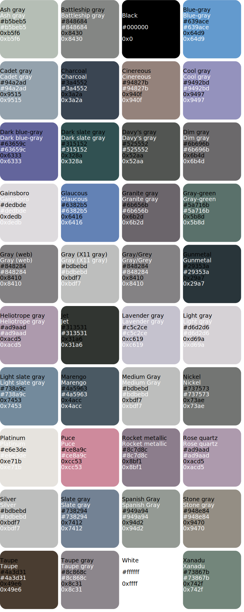

# rgb-565 color name definitions

------------------

installable header file containing definitions for RGB565 colors not defined in the arduino/ teensy libraries. 

* scraped from wikipedia's [Lists_of_colors](https://en.wikipedia.org/wiki/Lists_of_colors)

# colors
* [azure](#azure)
* [black](#black)
* [blue](#blue)
* [brown](#brown)
* [cyan](#cyan)
* [gray](#gray)
* [green](#green)
* [magenta](#magenta)
* [orange](#orange)
* [pink](#pink)
* [purple](#purple)
* [red](#red)
* [violet](#violet)
* [white](#white)
* [yellow](#yellow)
* [misc](#misc)

## azure 
|  Color | Name  | rgb565  |  rgb888 |
|---|---|---|---|
|   | Air Force Blue  | 0x5C54 | #5D8AA8 |
|   | Alice Blue  | 0xEFBF | #F0F8FF |
|   | Argentinian Blue  | 0x6D9D | #6CB4EE |
|   | Azure  | 0x041F | #0080FF |
|   | Azure (X11/web color)  | 0xEFFF | #F0FFFF |
|   | Baby Blue  | 0x8E7D | #89CFF0 |
|   | Berkeley Blue  | 0x018C | #003262 |
|   | Bleu de France  | 0x347C | #318CE7 |
|   | Blue (Crayola)  | 0x23BF | #1F75FE |
|   | Blue (Munsell)  | 0x0495 | #0093AF |
|   | Blue (NCS)  | 0x0437 | #0087BD |
|   | Brandeis Blue  | 0x039F | #0070FF |
|   | Celestial Blue  | 0x4CB9 | #4997D0 |
|   | Celtic Blue  | 0x2359 | #246BCE |
|   | Cerulean  | 0x03D4 | #007BA7 |
|   | Chefchaouen Blue  | 0x4C7C | #468fea |
|   | Columbia Blue  | 0xB6DD | #B9D9EB |
|   | Cornflower Blue  | 0x64BD | #6495ED |
|   | Deep Sky Blue  | 0x05FF | #00BFFF |
|   | Delft Blue  | 0x218B | #1F305E |
|   | Dodger Blue  | 0x249F | #1E90FF |
|   | French Blue  | 0x0397 | #0072BB |
|   | Green-blue  | 0x1336 | #1164B4 |
|   | Honolulu Blue  | 0x03B6 | #0076B6 |
|   | Jordy Blue  | 0x8DDD | #8AB9F1 |
|   | Lapis Lazuli  | 0x2B13 | #26619C |
|   | Light blue  | 0xAEBC | #ADD8E6 |
|   | Light Sky Blue  | 0x867E | #87CEFA |
|   | Maya Blue  | 0x761F | #73C2FB |
|   | Pale azure  | 0x869E | #87D3F8 |
|   | Picton Blue  | 0x459C | #45B1E8 |
|   | Polynesian Blue  | 0x2272 | #224C98 |
|   | Resolution Blue  | 0x0130 | #002387 |
|   | Royal blue (traditional)  | 0x012C | #002366 |
|   | Royal Blue (web color)  | 0x435B | #4169E1 |
|   | Ruddy Blue  | 0x755B | #76ABDF |
|   | Sapphire  | 0x092D | #082567 |
|   | Silver Lake Blue  | 0x5C57 | #5D89BA |
|   | Sky Blue  | 0x867D | #87CEEB |
|   | Spanish Blue  | 0x0397 | #0070BB |
|   | Steel Blue  | 0x4C16 | #4682B4 |
|   | Tang Blue  | 0x02D9 | #0059CF |
|   | True Blue  | 0x2B58 | #2D68C4 |
|   | Tufts Blue  | 0x447B | #3E8EDE |
|   | United Nations Blue  | 0x4C9B | #4B92DB |
|   | University of Pennsylvania Blue  | 0x010B | #011F5B |
|   | Uranian Blue  | 0xAEDE | #AFDBF5 |
|   | Vista Blue  | 0x7CFA | #7C9ED9 |
|   | Yale "Blue Site" Blue  | 0x01AD | #00356B |

## black 

## blue 

## brown 

## cyan 

## gray 

## green 

## magenta 

## orange 

## pink 

## purple 

## red 

## violet 

## white 

## yellow 

## misc 

