# rgb-565 color name definitions

------------------

installable header file containing definitions for RGB565 colors not defined in the arduino/ teensy libraries. 

* Find your color [Lists_of_colors](https://en.wikipedia.org/wiki/Lists_of_colors)

### credits 
I copied these values from this arduino forum thread, thanks to the author for saving me the time/effort.
https://forum.arduino.cc/index.php?topic=451297.0

# colors

## azure 
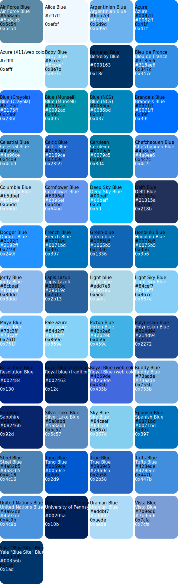

## black 
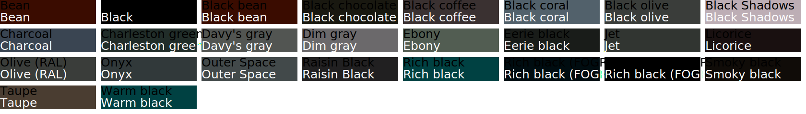

## blue 
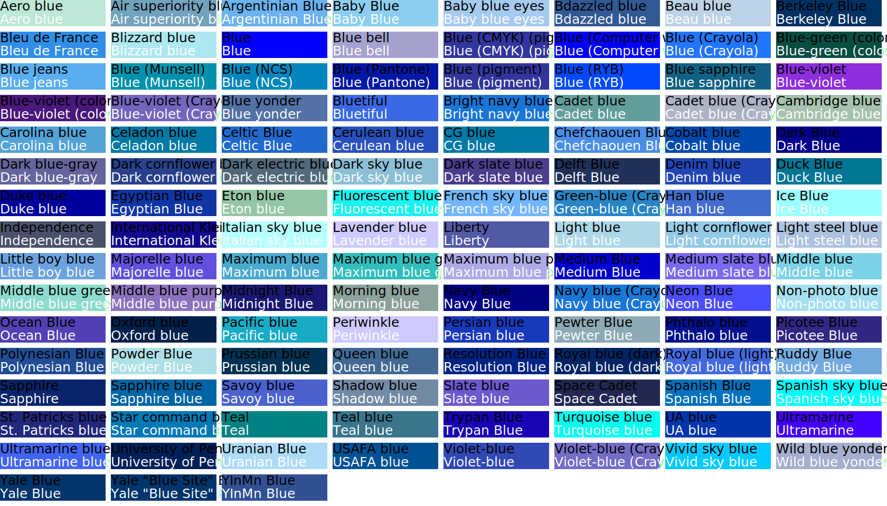

## brown 
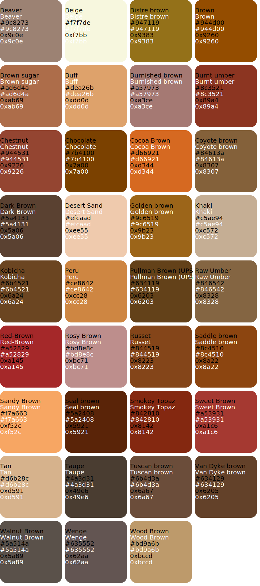

## cyan 
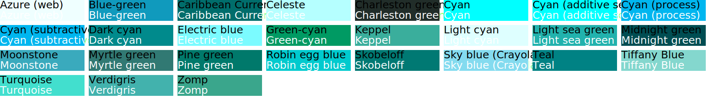

## gray 

## green 

## magenta 
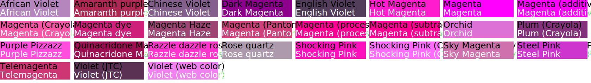

## orange 

## pink 
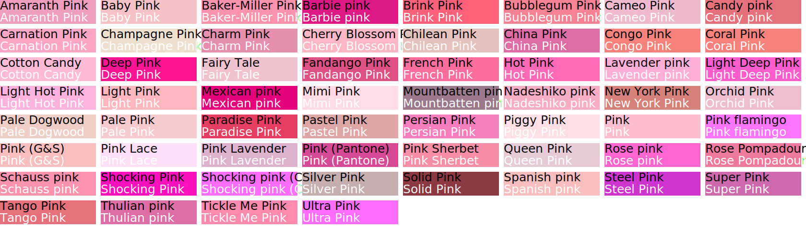

## purple 
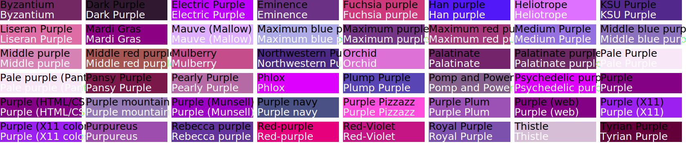

## red 
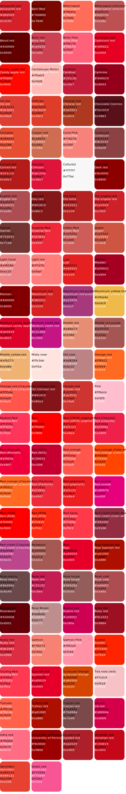

## violet 
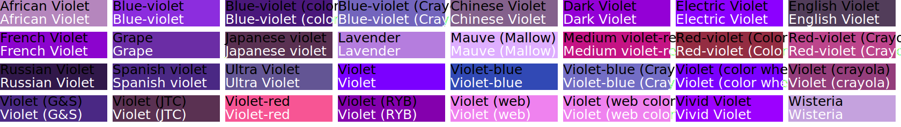

## white 
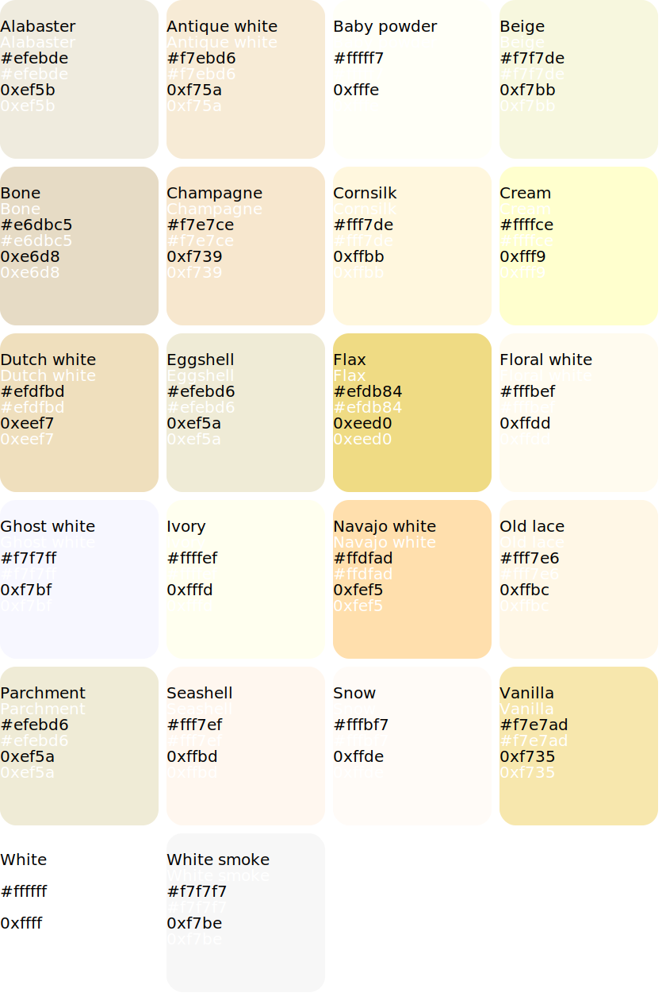

## yellow 
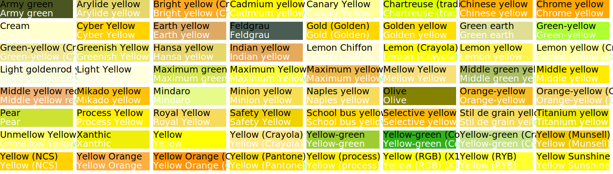

## misc 
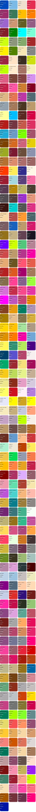
