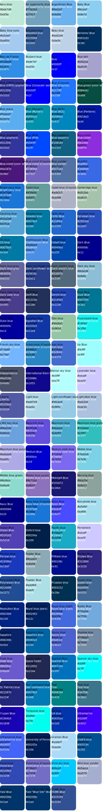
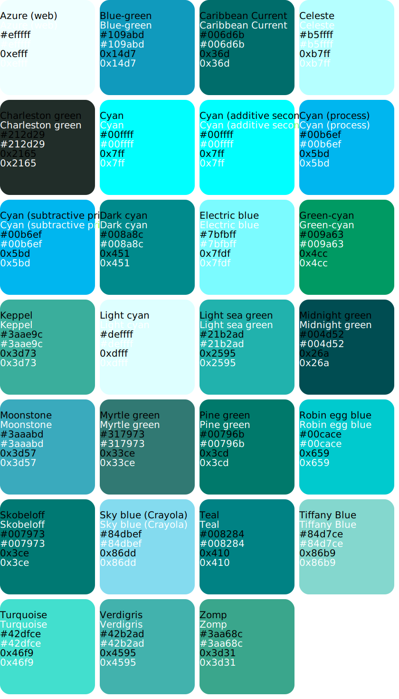
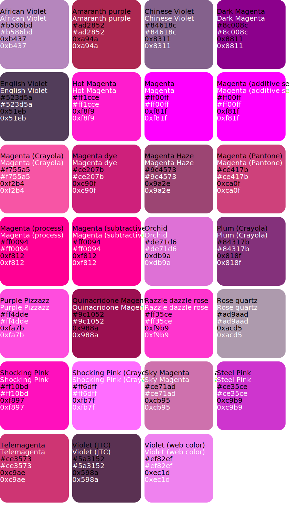
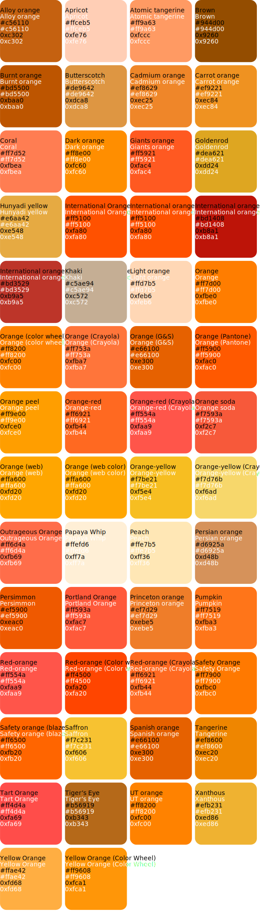
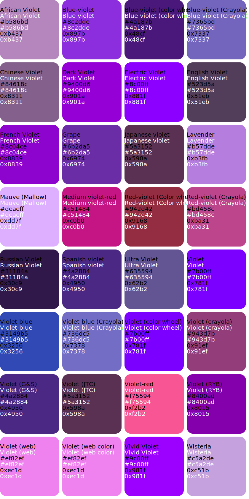
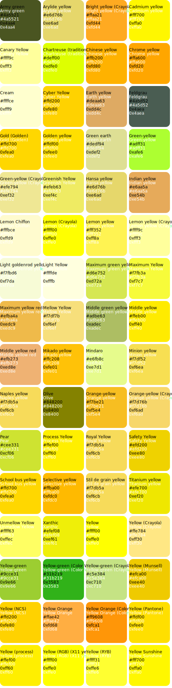

# rgb-565 color name definitions

------------------

installable header file containing definitions for RGB565 colors not defined in the arduino/ teensy libraries. 

* Find your color [Lists_of_colors](https://en.wikipedia.org/wiki/Lists_of_colors)

### credits 
I copied these values from this arduino forum thread, thanks to the author for saving me the time/effort.
https://forum.arduino.cc/index.php?topic=451297.0

# colors

## azure 

## black 

## blue 

## brown 

## cyan 

## gray 

## green 

## magenta 

## orange 

## pink 

## purple 

## red 

## violet 

## white 

## yellow 

## misc 

